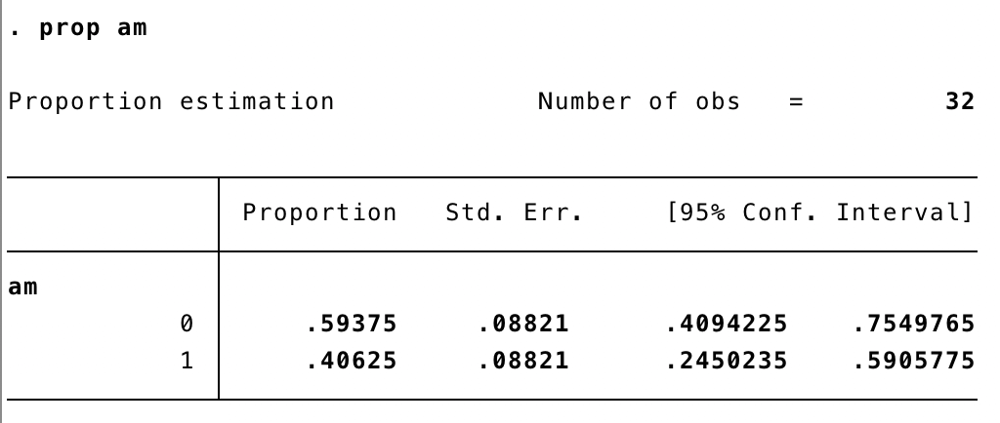
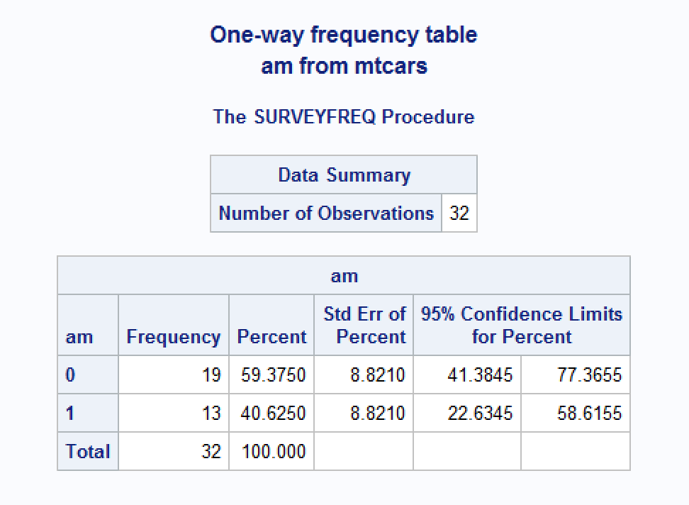
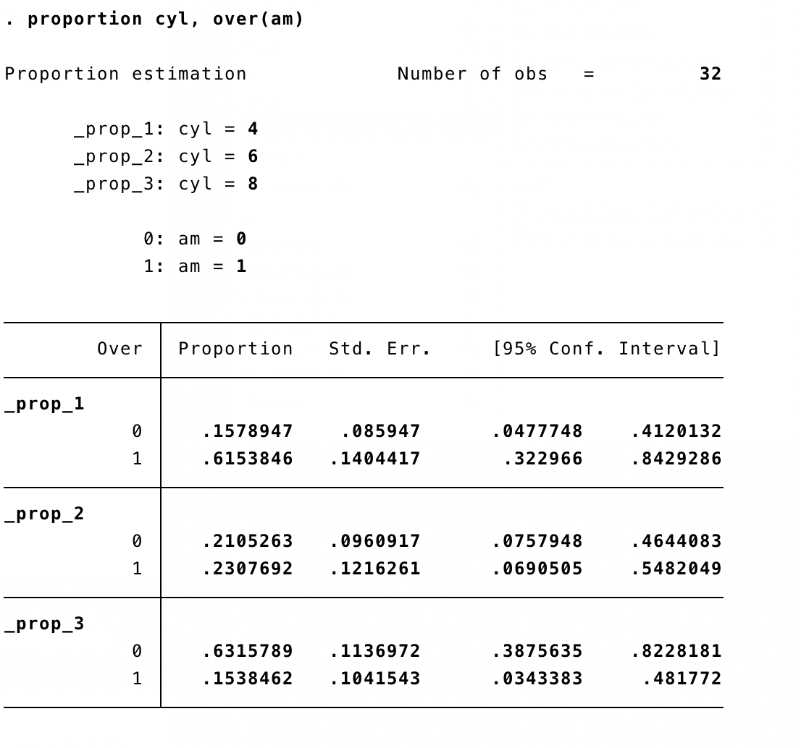
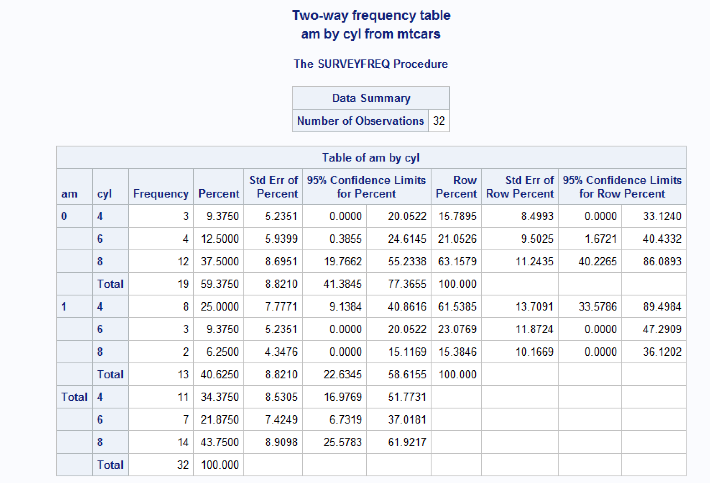

<style>
  hr 
  {
    background-color: #66b3ff;
    height: 1px;
  }
  blockquote
  {
    font-size: 12pt;
    font-style: italic;
    border-left: 4px solid #66b3ff;
  }
</style>

Table of contents:

[About data](#about-data)

[Univariate means and 95% confidence intervals](#univariate-means)

[Bivariate means and 95% confidence intervals](#bivariate-means)

[Univariate percentages and 95% log transformed confidence intervals](#one-way-log)

[Univariate percentages and 95% Wald confidence intervals](#one-way-wald)

[Bivariate percentages and 95% log transformed confidence intervals](#two-way-log)

[Interpretation of confidence intervals](#interpretation)

-------------------------------------------------------------------------------

I initially created this file to help develop the `freq_table` function in `bfuncs`. I've since adapted it to encompass general descriptive data analysis using R in a `dplyr` pipeline. Herein, descriptive analysis refers to basic univariate or bivariate statistics calculated for continuous and categorical variables (e.g., means and percentages). This vignette is not intended to be representative of every possible descriptive analysis that one may want to carry out on a given data set. Rather, it is intended to be representative of the descriptive analyses I most commonly need while conducting epidemiologic research.

```{r}
library(dplyr)
library(freqtables)
```

```{r}
data(mtcars)
```


-------------------------------------------------------------------------------

# About data {#about-data}

This is a really simple function. Frequently when I am working on an analysis project, I want to do a quick check of the data, but can't allow any of the raw data values to be exposed for privacy reasons. In such cases `str()` doesn't work, because some data values are visible in the returned output. Conversely, the `dim()` function works, but it's return value may not be intuitive to people viewing my code who aren't familiar with R. Therefore, I created the `about_data` function. 

I took this out in favor of using `dim()`. Keep it simple.

```{r}
dim(mtcars)
```


-------------------------------------------------------------------------------

# Univariate percentages and 95% Wald confidence intervals {#one-way-log}

In this section I provide an example of calculating common univariate descriptive statistics for categorical variables. Again, we are assuming that we are working in a *dplyr* pipeline, and that we are passing a grouped data frame to the `freq_table` function.

## Logit transformed confidence intervals

The default confidence intervals are logit transformed - matching the method used by Stata: https://www.stata.com/manuals13/rproportion.pdf

```{r}
mtcars %>% 
  freq_table(am, digits = 5)
```

&nbsp;

{width=600px}

&nbsp;

## Wald confidence intervals {#one-way-wald}

Optionally, the `ci_type = "wald"` argument can be used to calculate Wald confidence intervals that match those returned by SAS.

The exact methods are documented here:

https://support.sas.com/documentation/cdl/en/statug/63347/HTML/default/viewer.htm#statug_surveyfreq_a0000000221.htm

https://support.sas.com/documentation/cdl/en/statug/63347/HTML/default/viewer.htm#statug_surveyfreq_a0000000217.htm

```{r}
mtcars %>% 
  freq_table(am, ci_type = "wald", digits = 5)
```

&nbsp;

{width=600}

[top](#top)

&nbsp;


-------------------------------------------------------------------------------

# Bivariate percentages and 95% log transformed confidence intervals {#two-way-log}

In this section I provide an example of calculating common bivariate descriptive statistics for categorical variables. Again, we are assuming that we are working in a *dplyr* pipeline, and that we are passing a grouped data frame to the `freq_table` function.

Currently, all confidence intervals for (grouped) row percentages, and their accompanying confidence intervals, are logit transformed - matching the method used by Stata: https://www.stata.com/manuals13/rproportion.pdf

```{r}
mtcars %>% 
  freq_table(am, digits = 5)
```

{width=600}

&nbsp;

These estimates do not match those generated by SAS, which uses a different variance estimation method (https://support.sas.com/documentation/cdl/en/statug/63347/HTML/default/viewer.htm#statug_surveyfreq_a0000000217.htm).

{width=600}

[top](#top)


-------------------------------------------------------------------------------

# Interpretation of confidence intervals {#interpretation}

The following are frequentist interpretations for 95% confidence intervals taken from relevant texts and peer-reviewed journal articles.

**Biostatistics: A foundation for analysis in the health sciences**

> In repeated sampling, from a normally distributed population with a known standard deviation, 95% of all intervals will in the long run include the populations mean.

Daniel, W. W., & Cross, C. L. (2013). Biostatistics: A foundation for analysis in the health sciences (Tenth). Hoboken, NJ: Wiley.


**Fundamentals of biostatistics**

> You may be puzzled at this point as to what a CI is. The parameter µ is a fixed unknown constant. How can we state that the probability that it lies within some specific interval is, for example, 95%? The important point to understand is that the boundaries of the interval depend on the sample mean and sample variance and vary from sample to sample. Furthermore, 95% of such intervals that could be constructed from repeated random samples of size n contain the parameter µ.

> The idea is that over a large number of hypothetical samples of size 10, 95% of such intervals contain the parameter µ. Any one interval from a particular sample may or may not contain the parameter µ. In Figure 6.7, by chance all five intervals contain the parameter µ. However, with additional random samples this need not be the case. Therefore, we cannot say there is a 95% chance that the parameter µ will fall within a particular 95% CI. However, we can say the following: The length of the CI gives some idea of the precision of the point estimate x. In this particular case, the length of each CI ranges from 20 to 47 oz, which makes the precision of the point estimate x doubtful and implies that a larger sample size is needed to get a more precise estimate of µ.

Rosner, B. (2015). Fundamentals of biostatistics (Eighth). MA: Cengage Learning.

**Statistical modeling: A fresh approach**

> Treat the confidence interval just as an indication of the precision of the measurement. If you do a study that finds a statistic of 17 ± 6 and someone else does a study that gives 23 ± 5, then there is little reason to think that the two studies are inconsistent. On the other hand, if your study gives 17 ± 2 and the other study is 23 ± 1, then something seems to be going on; you have a genuine disagreement on your hands.

Kaplan, D. T. (2017). Statistical modeling: A fresh approach (Second). Project MOSAIC Books.

**Modern epidemiology**

> If the underlying statistical model is correct and there is no bias, a confidence interval derived from a valid test will, over unlimited repetitions of the study, contain the true parameter with a frequency no less than its confidence level. This definition specifies the coverage property of the method used to generate the interval, not the probability that the true parameter value lies within the interval. For example, if the confidence level of a valid confidence interval is 90%, the frequency with which the interval will contain the true parameter will be at least 90%, if there is no bias. Consequently, under the assumed model for random variability (e.g., a binomial model, as described in Chapter 14) and with no bias, we should expect the confidence interval to include the true parameter value in at least 90% of replications of the process of obtaining the data. Unfortunately, this interpretation for the confidence interval is based on probability models and sampling properties that are seldom realized in epidemiologic studies; consequently, it is preferable to view the confidence limits as only a rough estimate of the uncertainty in an epidemiologic result due to random error alone. Even with this limited interpretation, the estimate depends on the correctness of the statistical model, which may be incorrect in many epidemiologic settings (Greenland, 1990).

> Furthermore, exact 95% confidence limits for the true rate ratio are 0.7–13. The fact that the null value (which, for the rate ratio, is 1.0) is within the interval tells us the outcome of the significance test: The estimate would not be statistically significant at the 1 - 0.95 = 0.05 alpha level. The confidence limits, however, indicate that these data, although statistically compatible with no association, are even more compatible with a strong association — assuming that the statistical model used to construct the limits is correct. Stating the latter assumption is important because confidence intervals, like P-values, do nothing to address biases that may be present.

> Indeed, because statistical hypothesis testing promotes so much misinterpretation, we recommend avoiding its use in epidemiologic presentations and research reports. Such avoidance requires that P-values (when used) be presented without reference to alpha levels or “statistical significance,” and that careful attention be paid to the confidence interval, especially its width and its endpoints (the confidence limits) (Altman et al., 2000; Poole, 2001c).

> An astute investigator may properly ask what frequency interpretations have to do with the single study under analysis. It is all very well to say that an interval estimation procedure will, in 95% of repetitions, produce limits that contain the true parameter. But in analyzing a given study, the relevant scientific question is this: Does the single pair of limits produced from this one study contain the true parameter? The ordinary (frequentist) theory of confidence intervals does not answer this question. The question is so important that many (perhaps most) users of confidence intervals mistakenly interpret the confidence level of the interval as the probability that the answer to the question is “yes.” It is quite tempting to say that the 95% confidence limits computed from a study contain the true parameter with 95% probability. Unfortunately, this interpretation can be correct only for Bayesian interval estimates (discussed later and in Chapter 18), which often diverge from ordinary confidence intervals.

Rothman, K. J., Greenland, S., & Lash, T. L. (2008). Modern epidemiology (Third). Philadelphia, PA: Lippincott Williams & Wilkins.

**Greenland, 2016**

> The specific 95 % confidence interval presented by a study has a 95% chance of containing the true effect size. No! A reported confidence interval is a range between two numbers. The frequency with which an observed interval (e.g., 0.72–2.88) contains the true effectis either 100% if the true effect is within the interval or 0% if not; the 95% refers only to how often 95% confidence intervals computed from very many studies would contain the true size if all the assumptions used to compute the intervals were correct.

> The 95 % confidence intervals from two subgroups or studies may overlap substantially and yet the test for difference between them may still produce P < 0.05. Suppose for example, two 95 % confidence intervals for means from normal populations with known variancesare (1.04, 4.96) and (4.16, 19.84); these intervals overlap, yet the test of the hypothesis of no difference in effect across studies gives P = 0.03. As with P values, comparison between groups requires statistics that directly test and estimate the differences across groups. It can, however, be noted that if the two 95 % confidence intervals fail to overlap, then when using the same assumptions used to compute the confidence intervals we will find P > 0.05 for the difference; and if one of the 95% intervals contains the point estimate from the other group or study, we will find P > 0.05 for the difference.

Greenland, S., Senn, S. J., Rothman, K. J., Carlin, J. B., Poole, C., Goodman, S. N., & Altman, D. G. (2016). Statistical tests, P values, confidence intervals, and power: a guide to misinterpretations. European Journal of Epidemiology, 31(4), 337–350. https://doi.org/10.1007/s10654-016-0149-3

**Bottom Line** 

Give the point estimate along with the 95% confidence interval. Say NOTHING about statistical significance. Write some kind of statement about the data's compatibility with the model. For example, the confidence limits, however, indicate that these data, although statistically compatible with no association, are even more compatible with a strong association — assuming that the statistical model used to construct the limits is correct.
