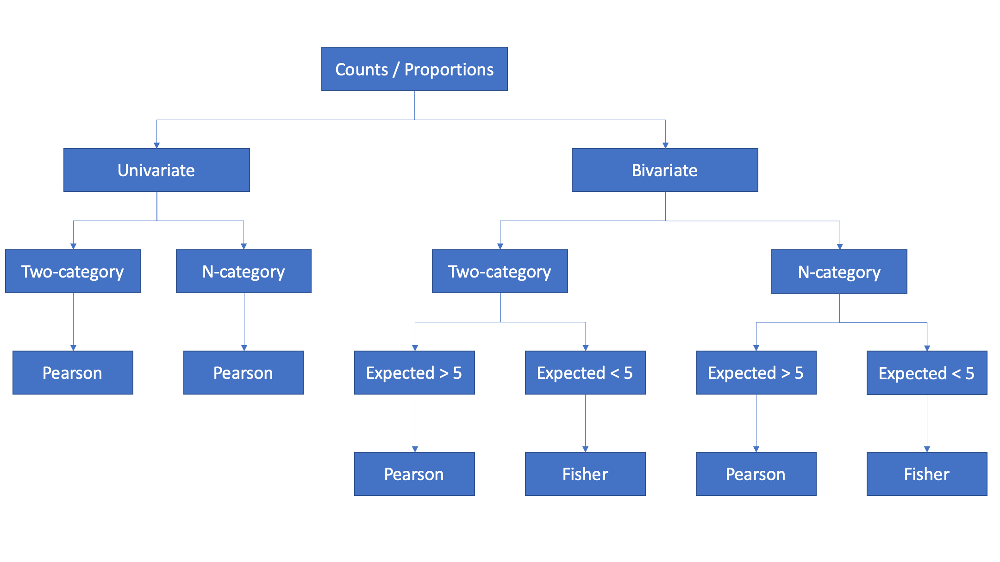
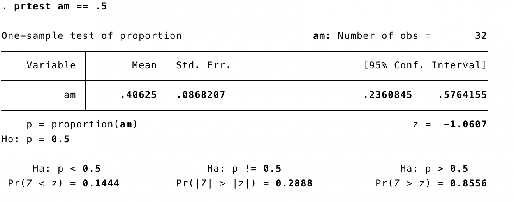
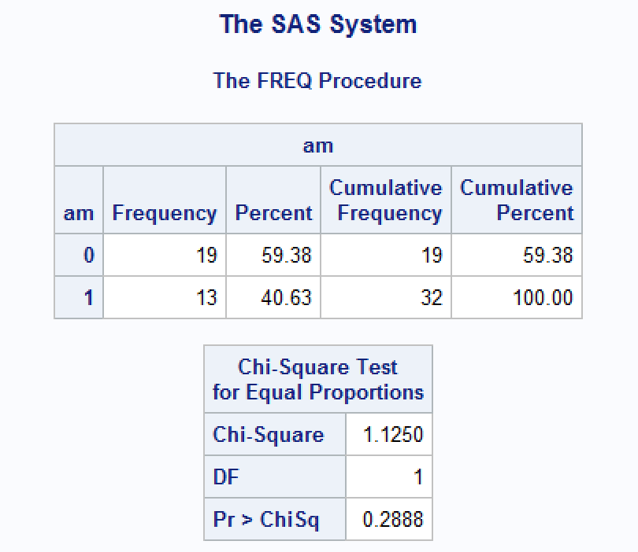
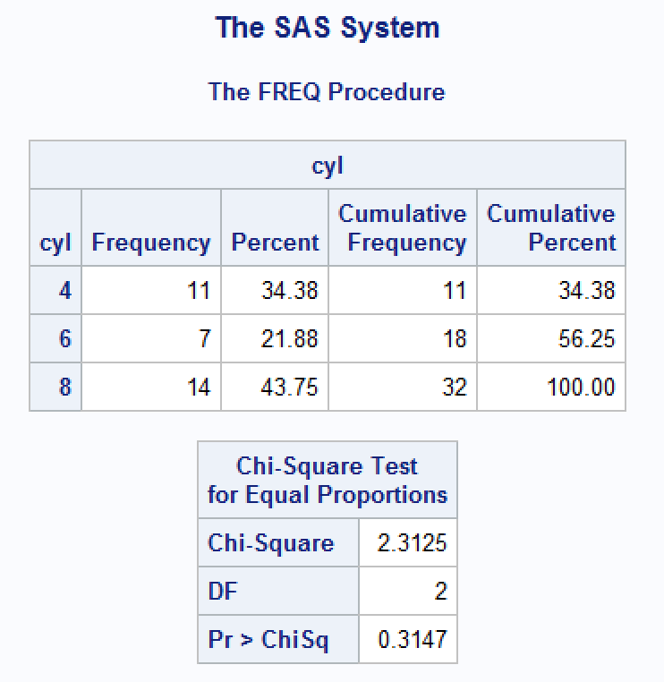
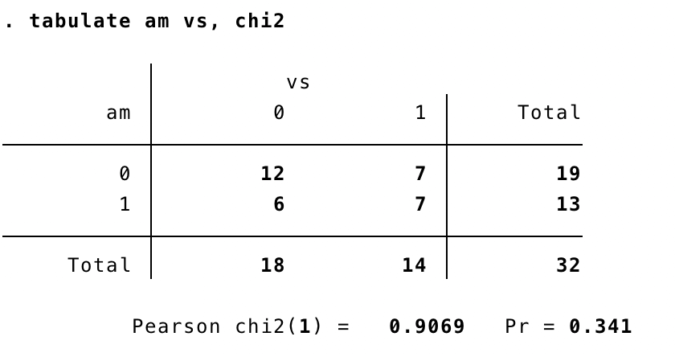
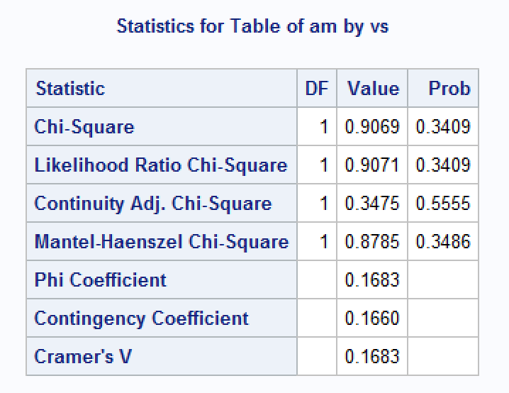
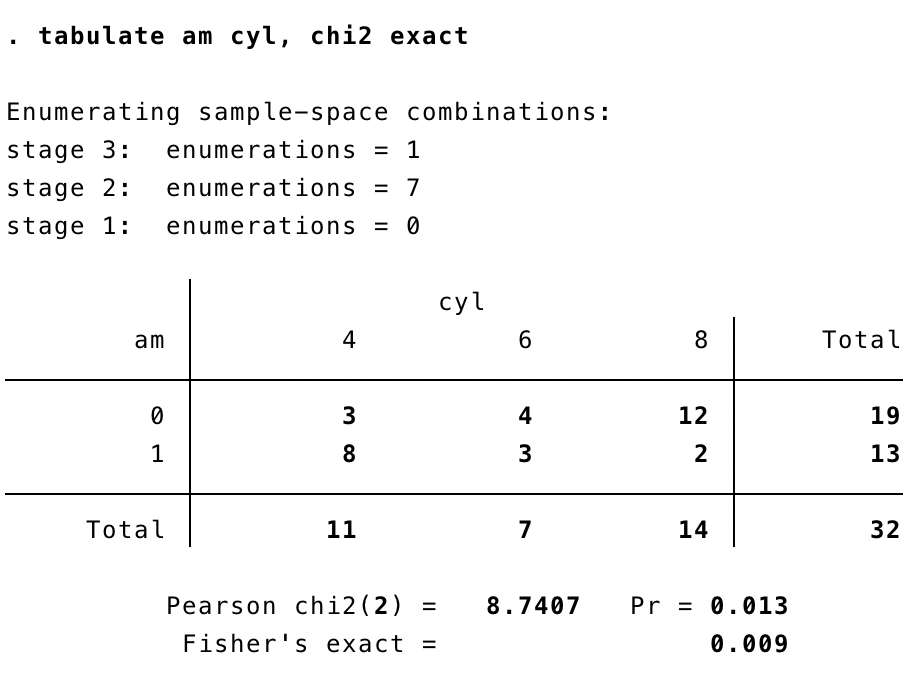
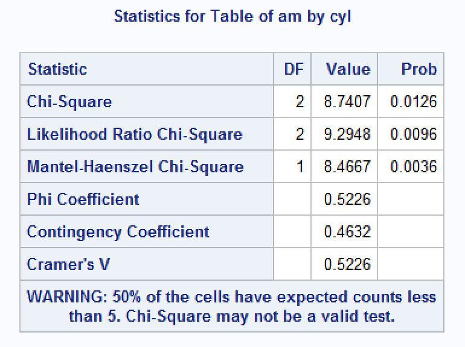

<style>
  hr 
  {
    background-color: #66b3ff;
    height: 1px;
  }
  blockquote
  {
    font-size: 12pt;
    font-style: italic;
    border-left: 4px solid #66b3ff;
  }
</style>

```{r, include = FALSE}
knitr::opts_chunk$set(
  collapse = TRUE,
  comment = "#>"
)
```

```{r setup}
library(freqtables)
library(dplyr)
```

```{r}
data(mtcars)
```

This vignette is about testing differences in frequencies/proportions, which is a common task in my data analysis workflow. Additionally, it's important to me that these tools work well in a dplyr pipeline.

Because we want different behavior for different classes of inputs, freq_test is an S3 generic function with multiple methods.

The name freq_test is easy to reason about, sounds similar to freq_table, which must be the input to freq_test, and is general enough to contain chi-square, fisher, etc.

The flowchart below illustrates the scenarios, and related hypothesis tests, discussed in this vignette.



# Table of Contents

* [Univariate Analysis - Test for equality of proportions](#univariate)

    - [Two categories](#uni-two-cat)
    
    - [More than two categories](#uni-n-cat)
    
* [Bivariate Analysis - Test for independence of two categorical variables](#bivariate)
    
    - [Two categories](#biv-two-cat)
    
    - [More than two categories](#biv-n-cat)
    
* [More on Pearson's Chi-square](#pearson)

* [More on Fisher's Exact Test](#fisher)
    
-------------------------------------------------------------------------------

# Univariate analysis {#univariate}

## Two categories {#uni-two-cat}

In some cases, we collect data from a single sample of people and measure the proportion of those people who can be classified (or categorized) according to some characteristic of interest. For example, suppose we collected data from a group of students and wanted to know what proportion of those students could be classified as males and females.

In the following code, we generate a small sample of students (n = 20). The student’s gender is drawn at random from a binomial distribution where being male or female are equally likely. Said another way, there is an equal number of male and female students on our hypothetical campus, and we have sampled a random subset of 20 of them without bias. In this context, “without bias” means that every student on our campus was equally likely to turn up in our sample.

```{r}
set.seed(123)
students <- tibble(
  male = rbinom(20, 1, 0.5)
)
```

Next, we can calculate the frequency with which each gender appears in our sample of 20 students.

```{r}
students %>% 
  freq_table(male)
```

The frequencies returned to us by `freq_table` tell us that our sample includes _9 females (which is 45% of all students in the sample) and 11 males (which is 55% of all students sampled)_. But, what about the precision of those estimates?

If we are only interested in the proportion of students in our sample that are male and female, then we’re done. We have our answer. Typically, though, our interest extends beyond our little sample. What we really want to know is if the proportion of males and females differ among all students on our hypothetical campus (our superpopulation).

I like the following quote from Daniel Kaplan that discusses sampling variability and its relationship to precision of our estimate:

> Less obvious to those starting out in statistics is the idea that a quantity such as the mean or median itself has limited precision. This isn't a matter of the calculation itself. If the calculation has been done correctly, the resulting quantity is exactly right. Instead the limited precision arises from the sampling process that was used to collect the data. The exact mean or median relates to the particular sample you have collected. Had you collected a different sample, it's likely that you would have gotten a somewhat different value for the quantities you calculate, the so-called sampling variability. One purpose of statistical inference is to characterize sampling variability, that is, to provide a quantitative meaning for "somewhat different value."   
> Kaplan, Daniel. Statistical Modeling: A Fresh Approach (Project MOSAIC Books) (Kindle Locations 844-850). Project MOSAIC Books. Kindle Edition. 

Further:

> Even if all the individuals in a population were included in a study, the study subjects are viewed as a sample of the potential biologic experience of an even broader conceptual population.   
> Rothman, Kenneth J. Modern Epidemiology (p. 149). Lippincot (Wolters Kluwer Health). Kindle Edition. 

In the case of our estimate above, we are characterizing the precision of our estimates in the form of 95% confidence intervals. Here, “precision” is a rough estimate of our uncertainty around the parameter we are interested in (i.e., the population proportion) based in the information we have available to us (Rothman, 2008). Perhaps it should be called an uncertainty interval or precision interval, rather than a confidence interval. The width of this measure of uncertainty is made up of a combination of sampling variability, the arbitrarily selected value for alpha (i.e., 0.05), the sample size, bias, and the underlying correctness of the model being applied to the data (Rothman, 2008; Kaplan, 2017). 

So, for the above sample, we simply state that _the percentage of female students was 45.00% (95% confidence interval 23.76% to 68.23%) and the percentage of male students was 55.00% (31.77% to 76.24%)_.

### Test for a difference in proportions

In the analysis above, we found that 45% of our _sample_ was female and 55% of our _sample_ was male. But again, we want to make reasonable estimates of whether or not the proportion of males and females differ among _all students on our hypothetical campus_. One common way to do so is with a null value hypothesis test. Specifically, in this example, we want to test the null hypothesis that the percentage of males and females among all students on our hypothetical campus are equal.

We can do so using methods based on the sample proportion of cases. They assume the normal approximation to the binomial distribution is valid. This assumption is reasonable when np0q0 ≥ 5 (Rosner, 2015, page 249).

```{r}
students %>% 
  freq_table(male) %>% 
  
  # Test for equal proportions
  summarise(
    p_bar = n[1] / n_total[1],
    p0 = 0.5,
    n = n_total[1],
    z = abs((p_bar - p0)) / sqrt(p0 * (1 - p0) / n),
    p = 2 * pnorm(z, lower.tail=FALSE)
  )
```

We can also get this value from R's built-in `prop.test` and R's built-in `chisq.test`.

```{r}
prop.test(9, 20, p = 0.5, correct = FALSE)
```

```{r}
chisq.test(c(9, 11), p = c(0.5, 0.5), correct = FALSE)
```

Finally, I’ve built this test into `bfuncs::freq_test`, which is designed to work in a `dplyr` pipeline. 

```{r}
students %>% 
  freq_table(male) %>% 
  freq_test()
```

### Interpretation

We can interpret this result in the following way: The probability of getting data that conflict with the tested hypothesis as much as or more than the observed data conflict with the tested hypothesis is 0.65, if the tested hypothesis is correct and all other assumptions used in computing the p-value are correct. These data are compatible with the null hypothesis of equal proportions of males and females on our hypothetical campus.
    
###  Assumptions

1. The study subjects may be treated as a simple random sample from a population of similar subjects (Daniel, 2013, page 258).

2. The sampling distribution of p_hat is approximately normally distributed in accordance with the central limit theorem (Daniel, 2013, page 258).

### Comparison to other statistical software

Here, and below, will will use the mtcars data for ease of comparison.

```{r}
mtcars %>% 
  freq_table(am) %>% 
  freq_test() %>% 
  select(1:6, p_chi2_pearson)
```

&nbsp;

These results match the results obtained from Stata and SAS (see below).

&nbsp;

-------------------------------------------------------------------------------

#### Stata

{width=600}

-------------------------------------------------------------------------------

#### SAS

{width=600}

&nbsp;

**Useful websites:**

[R tutor](http://www.r-tutor.com/elementary-statistics/hypothesis-testing/two-tailed-test-population-proportion)

[Penn State - Stat 414/415](https://onlinecourses.science.psu.edu/stat414/node/268)

[The DO Loop](https://blogs.sas.com/content/iml/2017/07/05/test-equality-two-proportions-sas.html)

**References:**

Daniel, W. W., & Cross, C. L. (2013). Biostatistics: A foundation for analysis in the health sciences (Tenth). Hoboken, NJ: Wiley.

Kaplan, D. T. (2017). Statistical modeling: A fresh approach (Second). Project MOSAIC Books.

Rosner, B. (2015). Fundamentals of biostatistics (Eighth). MA: Cengage Learning.

Rothman, K. J., Greenland, S., & Lash, T. L. (2008). Modern epidemiology (Third). Philadelphia, PA: Lippincott Williams & Wilkins.

&nbsp;

[TOC](#table-of-contents)

&nbsp;


-------------------------------------------------------------------------------

# Univariate analysis

## More than two categories {#uni-n-cat}

In this example we are still testing for equality of proportions. However, now we are testing for equality across more than two categories.

Notice that the syntax doesn't change. In fact, there isn't even an additional method needed for this scenario.

```{r}
mtcars %>% 
  freq_table(cyl) %>% 
  freq_test()
```

&nbsp;

This is the same result we get from SAS. I was unable to find an easy way to do this test in Stata.

&nbsp;

#### SAS

{width=600}

[TOC](#table-of-contents)

&nbsp;


-------------------------------------------------------------------------------

# Bivariate Analysis {#bivariate}

## Two categories {#biv-two-cat}

Now, suppose we are interested in the _relationship between_ two categorical variables. More precisely, we can estimate the degree of compatibility between our observed values, and the values we would expect to observe if the two characteristics we are analyzing were independent (i.e., knowing the value of one characteristic tells you nothing about the value of the other characteristic). 

For example, earlier we found that our data were compatible with the hypothesis that there are equal proportions of females and males on our hypothetical campus – our superpopulation. Now, we suspect that females and males in our superpopulation differ with respect to their binge drinking behavior. 

To investigate this hypothesis further, we will collect data from a simple random sample of students, measure their gender, and measure whether they binge drank in the last 30 days or not (yes/no). Then we will use the chi-square test of independence to draw conclusions about the degree of compatibility between our data, and the data we would expect to observe if binge drinking and gender were independent of one another.

```{r}
set.seed(456)
students <- tibble(
  male  = rbinom(20, 1, 0.5),
  binge = if_else(male == 0, 
                  rbinom(20, 1, 0.10), # 10% of females binge drink 
                  rbinom(20, 1, 0.30)) # 30% of males binge drink
)
```

```{r}
students %>% 
  freq_table(male, binge) %>% 
  freq_test()
```

There are a couple things worth mentioning here. First, 27% of the females in our sample engaged in binge drinking, compared to 22% of males – even though we know that the underlying probability in our superpopulation was 10% for females and 30% for males. This discrepancy highlights the potential for sampling variability, and small sample estimates, to be misleading. 

Additionally, because some expected cell counts were less than 5, we should estimate our p-value using Fisher’s exact method.

```{r warning=FALSE}
students %>% 
  freq_table(male, binge) %>% 
  freq_test(method = "fisher")
```

### Interpretation 

The large p-value (p = 1.0) calculated using Fisher's exact method indicates that the data are highly consistent with the null hypothesis of statistical independence between gender and binge drinking at our hypothetical campus, assuming that the null hypothesis is true and the study is free of bias. However, wide range of the 95% confidence intervals makes the precision of the point estimates doubtful. Another study using larger sample size is needed to get a more precise estimate of the relationship between gender and binge drinking.
    
###  Assumptions

1. Pretty much all of the tests we have encountered in this book have made an assumption about the independence of data and the chi-square test is no exception. For the chi-square test to be meaningful it is imperative that each person, item or entity contributes to only one cell of the contingency table. Therefore, you cannot use a chi-square test on a repeated-measures design (e.g., if we had trained some cats with food to see if they would dance and then trained the same cats with affection to see if they would dance, we couldn’t analyse the resulting data with Pearson’s chi-square test).

Field, Andy; Miles, Jeremy; Field, Zoe. Discovering Statistics Using R (p. 818). SAGE Publications. Kindle Edition. 

2. The expected frequencies should be greater than 5. Although it is acceptable in larger contingency tables to have up to 20% of expected frequencies below 5, the result is a loss of statistical power (so the test may fail to detect a genuine effect). Even in larger contingency tables no expected frequencies should be below 1. Howell (2006) gives a nice explanation of why violating this assumption creates problems. If you find yourself in this situation consider using Fisher’s exact test.

Field, Andy; Miles, Jeremy; Field, Zoe. Discovering Statistics Using R (p. 818). SAGE Publications. Kindle Edition. 

### Comparison to other statistical software

```{r}
mtcars %>% 
  freq_table(am, vs) %>% 
  freq_test() %>% 
  select(1:8, p_chi2_pearson)
```

&nbsp;

#### Stata

{width=600}

-------------------------------------------------------------------------------

#### SAS

{width=600}

[TOC](#table-of-contents)

&nbsp;


-------------------------------------------------------------------------------

# Bivariate Analysis

## More than two categories {#biv-n-cat}

```{r}
mtcars %>% 
  freq_table(am, cyl) %>% 
  freq_test()
```

&nbsp;

> There is one problem with the chi-square test, which is that the sampling distribution of the test statistic has an approximate chi-square distribution. The larger the sample is, the better this approximation becomes, and in large samples the approximation is good enough to not worry about the fact that it is an approximation. However, in small samples the approximation is not good enough, making significance tests of the chi-square distribution inaccurate.
> 
> Field, Andy; Miles, Jeremy; Field, Zoe. Discovering Statistics Using R (p. 816). SAGE Publications. Kindle Edition. 

```{r}
mtcars %>% 
  freq_table(am, cyl) %>% 
  freq_test(method = "fisher")
```

> Interpret
>
> Compare to Stata and SAS

&nbsp;

### Comparison to Stata and SAS

-------------------------------------------------------------------------------

#### Stata

{width=600}

-------------------------------------------------------------------------------

#### SAS

{width=600}

{width=300}

[TOC](#table-of-contents)

&nbsp;


-------------------------------------------------------------------------------

# Calculate Pearson's Chi-square {#pearson}

Pearson's chi-square is given by:

$$\chi^2=\sum \frac{(observed_{ij} - expected_{ij})^2}{expected_{ij}}$$

where,

$$expected_{ij} = \frac{row \ total * column \ total}{total}$$

For example:

```{r}
mtcars %>% 
  freq_table(am, vs) %>% 
  freq_test() %>% 
  select(1:4, n_col, n_total, n_expected:chi2_pearson)
```

After obtaining the Pearson chi-squared value (0.9068826 above), we compare it to the critical value for the chi-square distribution with degrees of freedom = (rows - 1)(columns - 1) = 1. If the observed value is bigger than the critical value, we conclude that there is a statistically significant relationship.

For example:

```{r}
mtcars %>% 
  freq_table(am, vs) %>% 
  freq_test() %>% 
  select(1:3, chi2_pearson:p_chi2_pearson)
```

And this is the same result we get from R's built-in chi-square test.

```{r}
chisq.test(mtcars$am, mtcars$vs, correct = FALSE)
```

However, our result has the following advantages (in my opinion):

* It let's us see how the result was obtained - giving us a better intuition about what our result really means, and how it may differ if we had collected a different sample.

* If fits easily into a dplyr pipeline.

* It results in tibble, rather than a list.

## Why not use Yate's continuity correction?

> When you have a 2 × 2 contingency table (i.e., two categorical variables each with two categories) then Pearson’s chi-square tends to produce significance values that are too small (in other words, it tends to make a Type I error). Therefore, Yates suggested a correction to the Pearson formula (usually referred to as Yates’s continuity correction). The basic idea is that when you calculate the deviation from the model (the observedij – modelij in equation (18.1)) you subtract 0.5 from the absolute value of this deviation before you square it. In plain English, this means you calculate the deviation, ignore whether it is positive or negative, subtract 0.5 from the value and then square it.
>
> The key thing to note is that it lowers the value of the chi-square statistic and, therefore, makes it less significant. Although this seems like a nice solution to the problem there is a fair bit of evidence that this overcorrects and produces chi-square values that are too small! Howell (2006) provides an excellent discussion of the problem with Yates’s correction for continuity, if you’re interested; all I will say is that, although it’s worth knowing about, it’s probably best ignored.
>
> Field, Andy; Miles, Jeremy; Field, Zoe. Discovering Statistics Using R (p. 817). SAGE Publications. Kindle Edition. 

## Why not use Pearson's chi-square with small sample sizes?

> There is one problem with the chi-square test, which is that the sampling distribution of the test statistic has an approximate chi-square distribution. The larger the sample is, the better this approximation becomes, and in large samples the approximation is good enough to not worry about the fact that it is an approximation. However, in small samples the approximation is not good enough, making significance tests of the chi-square distribution inaccurate. This is why you often read that to use the chi-square test the expected frequencies in each cell must be greater than 5.
> 
> Field, Andy; Miles, Jeremy; Field, Zoe. Discovering Statistics Using R (p. 816). SAGE Publications. Kindle Edition. 

## Assumptions

1. Independence of observations. Cannot use chi-square test on repeated or nested measures.

2. The expected frequencies should be greater than 5. Expected frequencies below 5 results in a loss of statistical power, and may fail to detect genuine effects (Type II error).

[TOC](#table-of-contents)

&nbsp;


-------------------------------------------------------------------------------

# Calculate Fisher's Exact Test {#fisher}

> Fisher’s exact test (Fisher, 1922) is not so much a test as a way of computing the exact probability of a statistic. It was designed originally to overcome the problem that with small samples the sampling distribution of the chi-square statistic deviates substantially from a chi-square distribution. It should be used with small samples.
>
> Field, Andy; Miles, Jeremy; Field, Zoe. Discovering Statistics Using R (p. 918). SAGE Publications. Kindle Edition. 

Fisher's exact test is computationally intensive. In order to get a feel for how it works, I've replicated a simple example from [Wolfram MathWorld](http://mathworld.wolfram.com/FishersExactTest.html) below.

In this example, X is a journal, say either Mathematics Magazine or Science, and Y is the number of articles on the topics of mathematics and biology appearing in a given issue of one of these journals. If Mathematics Magazine has five articles on math and one on biology, and Science has none on math and four on biology, then the relevant matrix would be:

```{r}
m_observed <- matrix(c(5, 0, 1, 4), nrow = 2, byrow = TRUE)
m_observed
```

Then calculate the conditional probability of getting the actual matrix given the particular row and column sums using the multivariate generalization of the [hypergeometric probability function](https://www.rdocumentation.org/packages/stats/versions/3.4.3/topics/Hypergeometric), which can be calculated as:

```{r}
p <- function(m) {
  
  # Calculate the marginal totals
  r1  <- sum(m[1, ])
  r2  <- sum(m[2, ])
  c1  <- sum(m[, 1])
  c2  <- sum(m[, 2])
  tot <- sum(m)
  
  # Calculate the conditional probability of getting the actual matrix given 
  # the particular row and column sums
  r1_fac  <- factorial(r1)
  r2_fac  <- factorial(r2)
  c1_fac  <- factorial(c1)
  c2_fac  <- factorial(c2)
  tot_fac <- factorial(tot)
  
  m_fac      <- factorial(m) # factorial of each cell of the matrix (i.e., 5!, 0!, 1!, 4!)
  prod_m_fac <- prod(m_fac)  # Multiply all of those values together
  
  numerator   <- r1_fac * r2_fac * c1_fac * c2_fac
  denominator <- tot_fac * (prod_m_fac)
  p <- numerator / denominator
  
  # Return p
  p
}
```

So, in the example above, the p value for our observed data (p_cutoff) equals:

```{r}
p_cutoff <- p(m_observed)
p_cutoff
```

Next, we need to calculate the p value for all other combinations of values that could have existed given the marginal totals in our observed matrix "m".

For example, 

4 1   
2 3   

would give us the same marginal totals (i.e., 5, 5, 6, 4)

Below I calculate the p for each possible combination, and save them into a vector for use in the next step. In this case, the possible combinations are given on the [Wolfram Mathworks website](http://mathworld.wolfram.com/FishersExactTest.html). I'm still searching for an efficient algorithm that will find these combinations.

```{r}
# Create a empty vector to hold the p values created in the loop below
p_values <- vector(mode = "numeric")

# Create a list of all possible combinations, given our margins
combinations <- list(
  c(4, 1 ,2, 3),
  c(3, 2, 3, 2),
  c(2, 3, 4, 1),
  c(1, 4, 5, 0)
)

# Calculate the p value for each combination and save it
for (i in seq_along(combinations)) {
  
  # Turn into a matrix
  m <- matrix(combinations[[i]], nrow = 2, byrow = TRUE)
  
  # Caclulate p
  p_val <- p(m)
  
  # Save p to vector
  p_values <- c(p_values, p_val)
}
```

These p-values should all sum to 1

```{r}
sum(p_values, p_cutoff)
```

Next, the P-value of the test can be simply computed by the sum of all P-values which are <= p_cutoff (including p_cutoff itself).

```{r}
df <- tibble(
  p_value  = p_values,
  p_cutoff = p_cutoff
) %>% 
  mutate(
    less_or_equal = p_value <= p_cutoff
  ) %>% 
  print()
```

```{r}
df %>% 
  filter(less_or_equal) %>% 
  summarise(
    `p-value` = sum(p_value, p_cutoff)
  )
```

And for comparison, let's check our results against R's built-in function for Fisher's Exact Test.

```{r}
fisher.test(m_observed)
```

```{r echo=FALSE}
# Clean up
rm(combinations, df, m, m_observed, i, p_cutoff, p_val, p_values, p)
```

[TOC](#table-of-contents)

&nbsp;
